```{r setup, include=FALSE}
library(tidyverse)
knitr::opts_chunk$set(echo = TRUE, message = FALSE, warning = FALSE, collapse = TRUE,fig.align='center')
```


## ¿Qué es R?

- R es un lenguaje de programación y un entorno para **manipular datos**, **realizar cálculos y gráficos**.
- R es un lenguaje **interpretado**, por lo que no es necesario compilar el código fuente.
- **Herramienta muy popular** para tareas de Data Science (junto con Python)
- Comparado con herramientas clásicas (Excel, SaS, SPSS)
    + Más flexible
    + Curva de aprendizaje inclinada
    + **Librerías**/**Paquetes**!

---

## Ventajas de R

- Proyecto GNU (**open source**), cualquiera puede contribuir al desarrollo.
- Gran cantidad de **paquetes/librerías** (9319 a 10 de octubre de 2019 -> 15103 a 12 de octubre de 2019):
  + https://cran.r-project.org/web/packages/
- La gran mayoría de nuevas tecnologías y algoritmos relacionados con **estadística** aparecen primero en R.
- **Documentación** abundante en Internet, muchos **grupos de usuarios** activos.
  + https://cran.r-project.org/other-docs.html

```{r, echo=FALSE, message=TRUE, warning=TRUE, out.width="50%"}
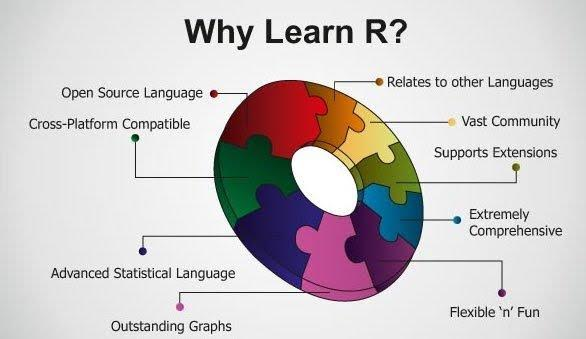
```

---

## Inconvenientes de R

- **Curva de aprendizaje inclinada**, como la mayoría de lenguajes de programación.

```{r, echo=FALSE, message=TRUE, warning=TRUE, out.width="50%"}
knitr::include_graphics("img/curva_de_aprendizaje.png")
```

- La calidad de algunos paquetes.
- **Gestión de memoria**
- **Menor rendimiento** que otros lenguajes de cálculo científico.

---

## Comparación de rendimiento


```{r, echo=FALSE, message=TRUE, warning=TRUE, out.width="100%"}
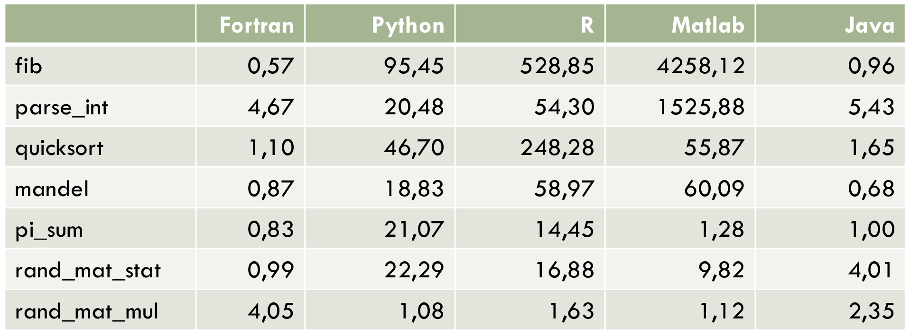
```
Tiempos de benchmark **relativos a C** (rendimiento de C=1.0). Fuente: https://julialang.org/

---


## R versus Python

```{r, echo=FALSE, message=TRUE, warning=TRUE, out.width="2500px"}
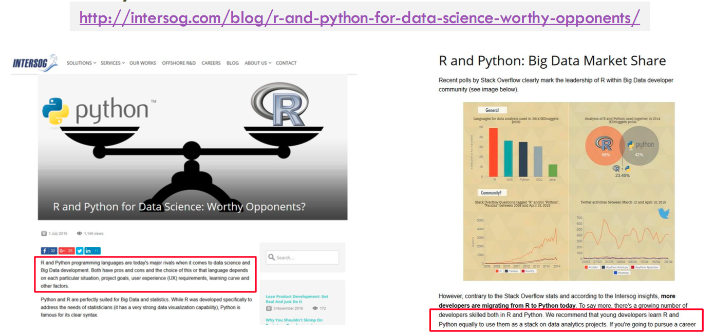
```


---
  
## Entorno

- R es **interpretado** &rarr; intérprete de R.
- El **intérprete de R** (Base R) está disponible para los principales sistemas operativos (Windows, Linux, MacOS): 
    + [http://cran.r-project.org](http://cran.r-project.org)

- Recomendado el uso del IDE RStudio
    + [http://www.rstudio.com](http://www.rstudio.com)
    + RStudio proporciona un entorno similar al de Matlab o al entorno Spyder de Anaconda.
    
---


## Entorno R: Instalando R y RStudio

**Base R**
.pull-left[
1. Descargar la versión adecuada de acuerdo al sistema operativo:
    + [Linux](https://cran.r-project.org/bin/linux/)
    + [Windows](https://cran.r-project.org/bin/windows/base/)
    + [OSX](https://cran.r-project.org/bin/macosx/)
]

.pull-right[
2. Arrancar el ejecutable:
```{r, echo=FALSE, message=TRUE, warning=TRUE, out.width="100%"}
knitr::include_graphics("img/r_ejecutable")
```
]


---

## Entorno R: Instalando R y RStudio

```{r, echo=FALSE, message=TRUE, warning=TRUE, out.width="100%"}
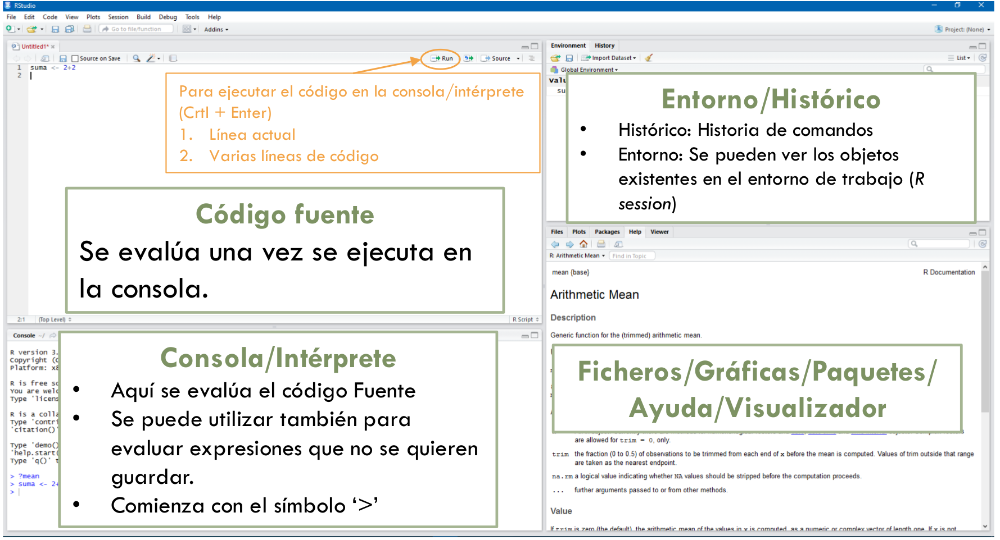
```

---

## Librerías


- R tiene una colección de **más de 12.000 librerías o paquetes de terceros**.
- La mayoría disponibles en un repositorio centralizado (CRAN).
- No forman parte del núcleo de R (R base).
  + Base R contiene muchas de las fucniones que se utilizarán comúnmente como `mean()` o `hist()`.
  + Solo las funciones implementadas por los autores originales de R se pueden encontrar en Base R.
- Se pueden instalar muy facilmente.
- Mucha de la funcionalidad de R viene dada por la cantidad de paquetes que existen.
  + [https://support.rstudio.com/hc/en-us/articles/201057987-Quick-list-of-useful-R-packages](https://support.rstudio.com/hc/en-us/articles/201057987-Quick-list-of-useful-R-packages)
  
---

## Instalar y cargar librerías


- **Instalando un nuevo paquete (I)**
  + Dos maneras comunas de instalar paquetes:
    1. Descarga del paquete de [CRAN](https://cran.r-project.org/)
      - Podemos instalar nuevas librerías con la sentencia:
      ```{r install_1, eval=F}
      install.packages("tidyverse")
      ```
      - RStudio también permite instalar el paquete de forma gráfica: `Packages > Install`
    2. Descarga del paquete de **Github**
      - Es necesario usar la funcion `install_github` que está en el paquete `devtools`
      ```{r install_2, eval=F}
      install.packages("devtools")
      library("devtools")
      install_github("ndphillips/yarrr", build_vignetes=TRUE)
    ```

---

## Instalar y cargar librerías


- **Instalando un nuevo paquete (II)**
  + Una vez instalado el paquete, no es necesario instalarlo nuevamente (salvo que se quiera instalar una nueva versión).
  
  + Si se quiere desinstalar/eliminar un paquete:
  
  1. Se puede hacer desde línea de comandos: `remove.packages(pkgs,lib)`
    
  2. Se pude hacer desde el entorno gráfico de RStudio: en la pestaña `Packages`, presionar el icono X al lado del nombre del paquete.
  

---

## Instalar y cargar librerías

- **Cargando un paquete**
  + Siempre que se quiera usar un paquete, éste deberá cargarse primero en la sesión de trabajo.
  
  + Para cargar un paquete se utiliza la función `library()`:
    ```{r install_4, eval=F}
    library(tidyverse)
    ```
  
  + También se puede cargar un paquete en el entorno gráfico, seleccionando el paquete en el menú `Packages`.
  
  + Una vez cargado, se pueden utilizar las funciones y datos definidos en el paquete.
  + Si se quiere "deshacer" la carga del paquete:
    - Desde línea de comandos: `detach("package:coda", unload=TRUE)`
    - Desde RStudio: quitar &#9745; del paquete en el menú `Packages`.
---

## Instalar y cargar librerías

```{r, echo=FALSE, message=TRUE, warning=TRUE, out.width="45%"}
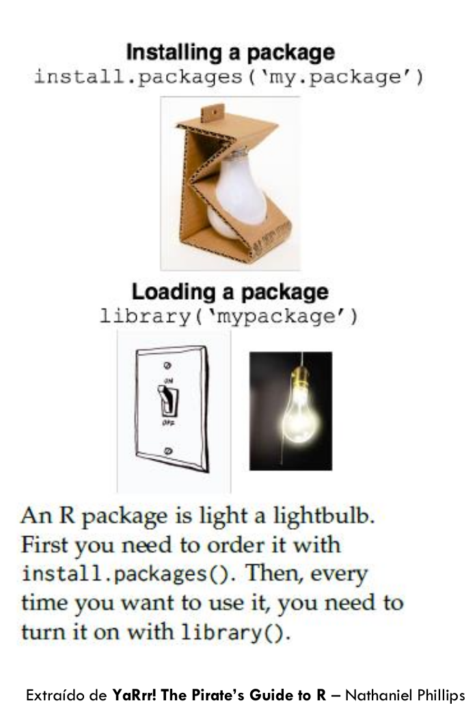
```
---


## Instalar y cargar librerías

```{r, eval=F}
install.packages(“circlize”)
library("circlize")
mat <- matrix(sample(1:100,6*7,replace=TRUE),6,7)
chordDiagram(mat)
remove.packages(“circlize”)
```
---


## Tidyverse

- Colección de paquetes diseñados para tareas de Data Science

- No son estrictamente necesarios, pero simplifican las tareas más comunes

- Los principales son: `dplyr`, `ggplot2`, `tidyr`, `readr`, `purrr`, `stringr`, `forcats` y `tibble`


---

## Comandos de R

- Distinguen entre mayúsculas y minúsculas.
- Los **comentarios** comienzan con el símbolo `#`.
- Se clasifican en **asignaciones** (el resultado se guarda) y **expresiones** (el resultado se imprime y se pierde).
- El operador de asignación es `<-` o `->` (no es aconsejable usar `=`).


```{r echo=T}
# este resultado se muestra y se pierde
2 + 2
```

```{r, echo=T}
# el resultado de la operación se almacena en una nueva variable 
# `suma`
suma <- 2 + 2
```

- Un **fichero de comandos** se carga con la expresión:
```{r,eval=F}
source("fichero.R")
```

- Para obtener **ayuda** sobre un determinado comando se utiliza la expresión `help("sum")`; o, alternativamente `?sum`.

---


## Funciones

- Construcción de R que toma unos argumentos de entrada, realiza un cálculo y devuelve un resultado
- El prototipo de las funciones en R tiene la siguiente forma:
```{r, eval=F}
  funcion(param, param2, ...., key1 = val1, key2 = val2,...)
```
- Los parámetros `key1 = val1` asignan el valor por defecto `val1` al parámetro `key1` y, por tanto, son **opcionales**.
- Los paramétros sin valor por defecto son **obligatorios** y deben especificarse en la llamada a la función.
- En R es común que las fucniones reciban un parámetro de forma de **lista de longitud variable**. Este parámetro se especficia con `...`.
  + Puede ser útil cuando se quiere escribir un número variable de argumentos o se quieren pasar argumentos adicionales a otra función que se invoca desde la primera.
- Ejemplos:
```{r,eval=F}
vector(mode = "logical", length=0)
aggregate(x, ...)
```

---

## Funciones
- Cuando se invoca a una función en R, se le pueden pasar los argumentos de 3 formas (por orden de prioridad):
  1. **Nombres exactos**: Los parámetros se asignan a los <u>nombres completos</u> explícitamente dados como argumentos.
  2. **Nombres parciales**: Los parámetros se asocian con <u>nombres parciales</u> explíticamente dados como argumentos.
  3. **Orden de los parámetros**: Los parámetros se asignan a los nombres en función a su <u>posición</u> en la llamada.
  
- **Ejemplo: función vector** `?vector`
```{r, eval=T}
vector(length=10)
vector(len=10, mode="numeric")
vector("numeric",10)
```

---

## Objetos y atributos

- R se compone de **objetos**.
- **¿Qué es un objeto?** Todas las entidades que R crea y manipula (escalares, vectores, *dataframes*, el resumen estadístico de una variable, un test estadístico, una función, etc.).
- Los objetos se almacenan en la **memoria RAM** del ordenador con un nombre específico.
* Para listar todos los objetos en memoria: `ls()`.
* Para eliminar la variable x de la memoria: `rm(x)`.
* Para eliminar todos los objetos de la memoria: `rm(list=ls())`.

---

## Objetos y atributos
- Al cerrar la sesión de R se pueden almacenar todos los objetos en el fichero `.RData`.
- Al abrir una nueva sesión se cargarán los objetos del fichero `.RData` almacenado en el directorio actual (si existe).

```{r, echo=FALSE, message=TRUE, warning=TRUE, out.width="80%"}
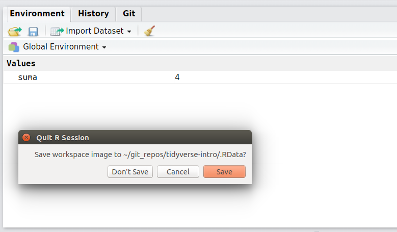
```

---

## Objetos y atributos

- Los tipos de datos **básicos** de R son: `logical`, `integer`, `double`, `complex`, `raw`, `character`, `list`, `NULL`, `closure (function)`, `special`, `builtin`, `environment`, `S4` ...
- El modo en un objeto es el tipo básico de los elementos que contiene. Viene dado por las funciones `mode()` y `typeof()`.

```{r, eval=T}
suma <- 2+2
typeof(suma)
mode(suma)
```

- Las funciones `is.integer()`, `is.numeric()`, etc. devuelven TRUE o FALSE dependiendo de si el objeto es del tipo especificado o no.
```{r, eval=T}
is.integer(suma)
is.character(suma)
```

---

## Objetos y atributos

- Para convertir de un modo a otro se utilizan las fucniones `as.integer()`, `as.numeric()`, etc.
  + Cualquier número diferente a 0 se convierte al valor lógico TRUE, mientras que el 0 se corresponde a FALSE.
  + El valor lógico TRUE se convierte con el valor numérico 1, mientras que valor lógico FALSE se corresponde con el valor numérico 0.
  
```{r,eval=T}
as.character(suma)
as.logical(suma)
cero <- 0 
as.logical(cero)
```

---

## Objetos y atributos

- Diferentes tipos de objetos tienen diferentes atributos.
  + La lista de atributos de un objeto se puede obtener con la función `attributes()`.
  + Para obtener o modificar un atributo en particular, se puede utilizar la función `attr(objeto, "nombre del atributo")`.

```{r,eval=T}
library(stats)
head(cars)
attributes(cars)
```

---

## Objetos y atributos


```{r, echo=FALSE, message=TRUE, warning=TRUE, out.width="100%"}
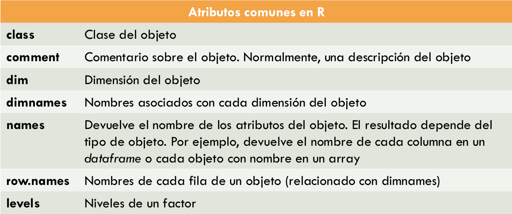
```


---

## Vectores

- Un vector es una secuencia de datos del <u>mismo tipo básico</u>.
  + Un escalar, carácter, etc. son vectores de longitud 1.
- Ejemplos para crear vectores:
  + **Función `c()` (combinar)**:
```{r, eval=T}
c(3.14, 15, 92)
c("cadena", "d", 'caracteres')

# En caso de que los argumentos sean de distinto tipo se castean al tipo
# más general de acuerdo al orden: NULL < raw < logical < integer <
# double < complex < character < list < expression
c(TRUE, 3.14, "pi")
```
  + **Función `vector()`**:
```{r,eval=T}
vector()
vector("numeric",10)
```

---

## Vectores

- Ejemplos para crear vectores:
  + **Función `rep(x, times, each)`**:
```{r, eval=T}
rep(x=c("A","B","C"), each=2, times=3)
rep(x=c(1,2,3), length.out=10)
```
  + **Función `a:b` (para vectores numéricos)**:
```{r,eval=T}
1:10
2.5:8.5
```
  + **Función `seq` (para vectores numéricos)**:

```{r, eval=T}
seq(from=0.5, to=2.6, by=0.5)
seq(from=10, to=1, by=-2)
seq(from=9, to=1, length.out=4)
```

---

## Vectores (aleatorios)

- R tiene varias funciones para generar números aleatorios.
  1. A partir de valores especificados
    ```{r,eval=T}
    sample(x=1:10, size=5)
    sample(x=1:10, size=20, replace=TRUE)
    # Ejercicio: simular 5 tiradas de una moneada trucada ("cara", "cruz") con probabilidad de "cara" de 0.8
    ```
  
  2. A partir de distribuciones de probabilidad conocidas (normal, uniforme, etc.). Para ver todas las distribuciones: `?Distributions`.
    ```{r,eval=T}
    rnorm(n=10, mean=4, sd=0.5)
    runif(n=10, min=4, max=10)
    ```

---


## Operaciones sobre vectores

```{r, eval=T}
x <- 1:10
# Longitud del vector
length(x)

# Operaciones con escalares: +,-,*,/,^,%% y %/%
x*4

# Operaciones con vectores de igual longitud
y <- 10:1
x + y

# Operaciones con vectores de distinta longitud:
# los vectores más cortos reciclan sus elementos hasta tener la 
# longitud del más largo
z <- 10:8
x + z

# Operaciones lógicas: !, &, |, xor(x,y)
x <- 1:3
z <- c(1,0,3)
!z
x & z
```
---

## Operaciones sobre vectores

```{r, eval=T}
# Funciones: log, exp, sin, cos, tan, sqrt, ceiling, floor, round...
x <- pi * 1:5
sin(x)

# Funciones estadísticas: sum, product, min, max, mean, sd, var, quantile, summary
x <- rnorm(n=5, mean=10, sd=5)
mean(x)
summary(x)

# ¡OJO con los missing values!
x <- c(1,2,3,NA,5,6,NA,8,9,0)
mean(x)
mean(x,na.rm=T)

# Valores únicos y conteo
x <- rep(c("a","b",NA),each=2,length.out=15)
unique(x)
# Si no ponemos exclude=NULL no contará los missing values
table(x,exclude=NULL)
```


---

## Indexado de vectores

- **Ejemplo**: seleccionar el primer y tercer elemento del vector `x <- c(5, -8, 2, -1)`.

```{r, eval=T}
x <- c(5, -8, 2, -1)
# 1. Indexado por vector lógico
y <- c(TRUE, FALSE, TRUE, FALSE)
x[y]

# 2. Indexado por vector de enteros positivos
y <- c(1,3)
x[y]

# 3. Indexado por vector de enteros negativos
y <- c(-2, -4)
x[y]

# 4. Indexado por vecor de nombres (¡solo si el vector tiene nombres!)
names(x) <- c("primero","segundo","tercero","cuarto")
y <- c("primero","tercero")
x[y]
```

---

### Indexado de vectores por condiciones lógicas

- Es común obtener los índices de indexado a partir de operaciones lógicas sobre el propio vector u otros vectores.
```{r,eval=T}
# Obtener los elementos mayores a 5 de un vector
x <- c(3,4,6,1,6,3,2,10,7)
x[x>5]

# Obtener la edad media de los hombres
genero <- c("H","M","M","H","H","M")
edad <- c(25, 21, 34, 45, 22, 61)
mean(edad[genero=="H"])

# Contar el número de elmentos de un vector mayores que 0
x <- rep(x = c(1,-1), each=5)
sum(x > 0)

# Indices de elementos mayores a 0
which(x>0)

# Proporción de elementos mayores que 0.
mean(x > 0)
```

---

## Indexado de vectores por condiciones lógicas (cont.)

- R tiene muchas funciones que toman vectores como argumentos y <u>devuelven vectores lógicos obtenidos en base a múltiples criterios</u>.

- R implementa las operaciones lógicas "estándar" (negación `!`, and `&` y or `|`), además de otras operaciones lógicas muy útiles para la manipulación de datos.


```{r, echo=FALSE, message=TRUE, warning=TRUE, out.width="100%"}
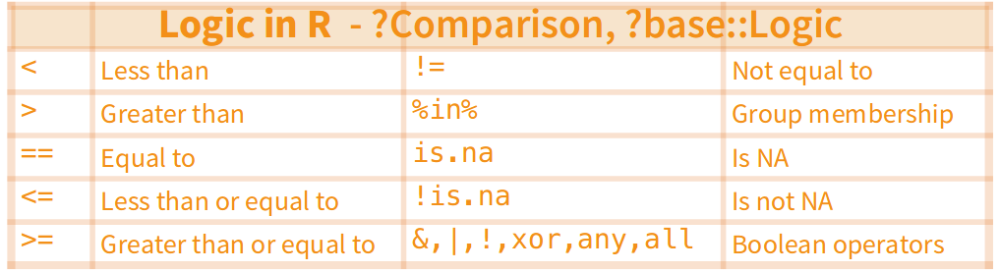
```


<!--
```{r, echo=FALSE, message=TRUE, warning=TRUE, out.width="100%"}
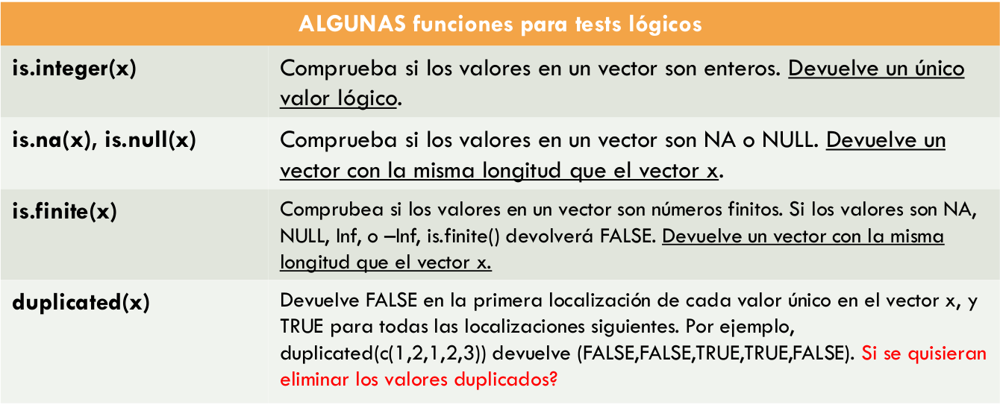
```
-->
---

## Indexado de vectores por condiciones lógicas (cont.)

- **Ejemplo**: generar un vector x con 250 valores enteros aleatorios entre 1 y 1000.
 1. Calcular el máximo y el mínimo del vector.
 2. Calcular la media del vector. ¿Qué valor esperarías?
 3. Calcular cuántas veces aparecen cualquiera de números 3,14,15 o 92.

---


## Operaciones de conjuntos sobre vectores
- Sobre los vectores se pueden hacer las operaciones matemáticas estándar de conjuntos: union, intersección, diferencia, etc.
```{r,eval=T}
a <- c(2,4,5,6,1,2,5)
b <- c(1,7,10,9,2,1,2)
# union
union(a,b)

# intersección asimetrica
intersect(a,b)
intersect(b,a)

# diferencia
setdiff(a,b)

# igualdad de conjuntos
setequal(a,b)

# pertenencia de un elemento al conjunto
is.element(10,a)
```

---

## Asignación en vectores

- ¡OJO!

```{r, eval=T}
x <- rep(x = c(1,-1), each=5)
x[1:5] <- 20:99
x

x[1:3] <- c(1,2)
x

x[1:4] <- c(1,2)
x

```

---

## Arrays
- Un **array** es una colección de datos del <u>mismo tipo</u> indexada por <u>varios índices</u>.
- Una **matriz** es un array de 2 dimensiones.
- R implementa los arrays como vectores (no como vectores de vectores, o una lista de vectores), **pero con los atributos `dim` y, opcionalmente, `dimnames`**.
- La función `array` se utiliza para crear arrays. Los valores especificados para la inciialización se rellenan con el primer índice variando más rápido.

```{r, eval=T}
x <- 1:10
a <- array(x, dim=c(5,2))
a

# Con dim recuperamos las dimensiones del array
dim(a)
```

---

## Indexado de arrays
- El indexado de arrays es como el indexado de vectores en cada una de las dimensiones del array.

```{r, eval=T}
z <- array(1:60, dim=c(3,5,4))
z[1:2, -(1:4), 2]

# Si un vector índice está vacío, se selecciona todo el rango
# de valores
z[,1,1]

# Los arrays también se pueden indexar con otro array de índices
idx <- array(c(1:2, 1:3), dim=c(2,3))
idx
z[idx]
```
---

## Aritmética de arrays

- En los arrays se pueden emplear operaciones aritméticas y lógicas (elemento a elemento).
  + A diferencia de los vectores, los arrays tienen que tener la misma longitud en todas las dimensiones.
- Las funciones `log`, `exp`, `sin`, `cos`, etc. se calculan elemento a elemento del array.
- Las funciones `sum`, `mean`, `var`, etc. se pueden aplicar en arrays de igual forma que en vectores y devuelven la suma, media, varianza, etc. de todos los elementos.
- Las funciones `colSums`, `rowSums`, `colMeans`, `rowMeans` calculan la suma y la media, respectivamente, a lo largo de la dimensión especificada.

```{r, eval=T}
z <- array(1:20, c(10,2))
mean(z)
colSums(z)
rowSums(z)
```

---

## Matrices
- Una matriz es un array de 2 dimensiones.
  + Se pueden utilizar las mismas **funciones** que para los arrays.
  + El **indexado** se realiza de igual forma que para los arrays.
  + Se puede crear la matriz usando `array` o `matrix`.
```{r,eval=T}
m <- matrix(1:10, nrow=2,ncol=5)
m
```  


```{r, echo=FALSE, message=TRUE, warning=TRUE, out.width="90%"}
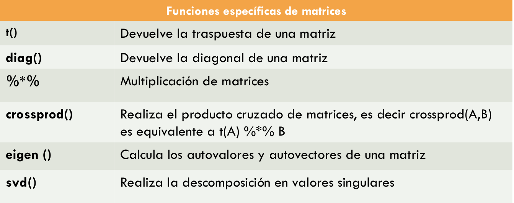
```


---

## Listas
- Una lista consiste en una colección ordenada de objetos <u>del mismo o distinto tipo</u>.
- Las listas son un elemento muy importante en R, ya que permiten la construcción de **estructuras heterogéneas**.
  + Los *dataframes* se basan en listas.
- Una lista se crea con la función `list`.
  + Si un elemento se especifica como `nombre=valor`, entonces, ese elemento en la lista tiene el nombre `nombre`.
  + Se puede acceder a los nombres de los elementos con la función `names()`.
  
```{r, eval=T}
parcela <- list(destino="Madrid", dimensiones=c(2,6,9),
precio=51000)
parcela
```

---

## Indexado de listas

- Los componentes de la lista <u>siempre están numerados</u> y son accesibles mediante **dobles corchetes**.
```{r,eval=T}
parcela[[1]]
parcela[["dimensiones"]]
```
- Los componentes también se pueden acceder con el operador `$`:
```{r,eval=T}
parcela$precio
```
- Se puede obtener una **sublista** usando **corchetes simples** y el mismo indexado visto para vectores.
```{r,eval=T}
parcela[c(1,2)]
```
---

## Operaciones sobre listas

```{r,eval=T}
# se pueden modificar sus elementos
parcela$destino <- "Granada"

# Si el nombre del elemento no existe, se añade a la lista:
parcela$titular <- "Francisco Ruiz"

# Las listas se pueden combinar con la función c()
new <- list(anyocompra=2014, telefonos=c(912596582,916359875))
c(parcela, new)
```

---


## Factores
- Un factor es un vector que contiene una clasificación discreta de sus elementos.
- Se suelen utilizar para almacenar **variables categóricas** (hombre/mujer).
- Se crean con la función `factor` y se pueden ver los **niveles** (valores distintos) con la función `levels`:
```{r,eval=T}
genero <-
factor(c("hombre","mujer","mujer","mujer","hombre","hombre","mujer","hombre","hombre","mujer","mujer","hombre"))
levels(genero)
```

- Los **factores ordenados** permiten establecer un orden en las categorías. Ejemplo: encuesta de satisfacción.
```{r,eval=T}
encuesta.resultados <- factor(c("Desacuerdo","Neutral","Fuertemente desacuerdo","Neutral","Deacuerdo","Fuertemente deacuerdo","Desacuerdo","Fuertemente deacuerdo","Neutral", "Fuertemente desacuerdo","Neutral","Deacuerdo"), levels=c("Fuertemente desacuerdo","Desacuerdo","Neutral","Deacuerdo","Fuertemente deacuerdo"),ordered=TRUE)
encuesta.resultados
```


---
## Dataframes

- Tabla para almacenar datos en R.
- Está compuesto por observaciones (filas) y variables (columnas).
- Cada variable puede ser de un tipo distinto (texto, categórica, numérica, etc.)
- Todas las observaciones de una misma variable tienen que ser del mismo tipo.
- Cada variable tiene un nombre.


```{r, echo=FALSE, message=TRUE, warning=TRUE, out.width="90%"}
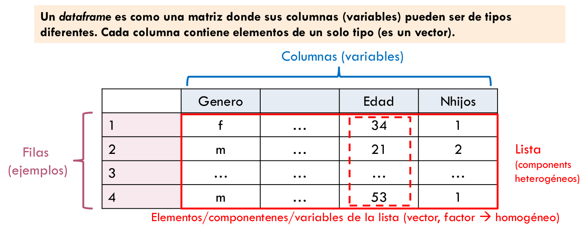
```


---

## Dataframes

- Para crear un dataframe a partir de vectores se puede utilizar la función `data.frame`.
```{r,eval=T}
d <- data.frame(index = 11:15, sex =
c("m","m","m","f","f"), age = c(99, 46, 23, 54, 23))
d
```

- Además, se pueden utilizar las funciones `cbind` y `rbind` para apendizar columnas y filas, respectivamente.
```{r,eval=T}
# aniadir columna a dataframe
d2 <- cbind(d,weight=c(80,70,85,49,57))

# aniadir fila a dataframe
d3 <- rbind(d2,list(16, "f", 31, 68))
```

---
## Dataframes
- Los datafames tienen las siguientes **restricciones**:
  + Los componentes debn ser vectores, factores, matrices, listas u otros dataframes.
  + Las matrices, listas y dataframes contribuyen al nuevo dataframe con tantas variables como columnas, elementos o variables tengan.
    ```{r,eval=T}
    d3 <- rbind(d2,list(16, "f", 31, 68))
    ```
  + Los vectores no numéricos se transforman en factores, salvo que se indique lo contrario.
    ```{r,eval=T}
    d <- data.frame(index = 11:15, sex =
c("m","m","m","f","f"), age = c(99, 46, 23, 54, 23),stringsAsFactors = FALSE)
    str(d)
    ```
  + Todos los vectores tienen que tener la misma longitud y las matrices el mismo número de filas.


---

## Funciones de dataframes
```{r, echo=FALSE, message=TRUE, warning=TRUE, out.width="100%"}
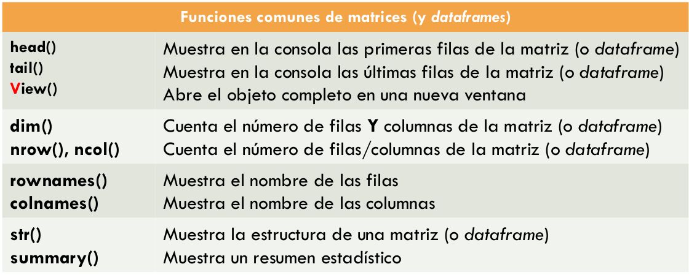
```

Además, R tiene algunos dataframes pre-instalados en un paquete llamado `datasets` e includio en base R.
  + Para ver la lista completa de datasets: `library(help="datasets")`.
  + Para ver información detallada de un dataset: `help(<nombre del dataset>)`; por ejemplo: `help(mtcars)`.

---

## Funciones de dataframes

```{r, eval=T}
# Número de filas
nrow(mtcars)

# Número de columnas
nrow(mtcars)

#Nombres de las columnas
colnames(mtcars)

# Primeras 5 lineas
head(mtcars,5)
```


---

## Funciones de dataframes

```{r, eval=T}
# Estructura del dataframe
str(mtcars)
```

---

## Funciones de dataframes

```{r, eval=T}
# Estadísticas de las variables
summary(mtcars)
```

---

## Indexado de dataframes

- **Indexado de una variable/columna**. Generalmente se devuelve un vector del mismo tipo que el elemento del dataframe.
```{r, eval=F}
# Con doble de corchete e índice de la columna
mtcars[[1]]

# Con doble corchete y nombre de la columna
mtcars[["mpg"]]

# $nombrecolumna
mtcars$mpg
```

- **Indexado de un subconjunto de variables**. El resultado es otro dataframe.
```{r, eval=F}
# con corchetes simples e indices de las columnas (positivos o negativos)
mtcars[c(1,3)]
mtcars[c(-2,4)]

# con corchetes simples y vector con nombre de columnas
mtcars[c("mpg","disp")]
mtcars[c("mpg","disp","drat","wt","qsec","vs","am","gear","carb")]

# con corchetes simples y un vector lógico
mtcars[c(TRUE,FALSE,TRUE,FALSE,T,T,T,T,T,T,T)]
```

---
## Indexado de dataframes

- **Indexado de un subconjunto de filas**. El resultado es otro dataframe.
  + **¡OJO!** Con la coma después del indexado de filas. Aunque se quieran seleccionar todas las columnas, es necesaria.
```{r, eval=F}
# Índices enteros (positivos o negativos)
mtcars[1:2,]
mtcars[-32:-3,]

# Nombre(s) de fila(s)
mtcars[c("Mazda RX4", "Mazda RX4 Wag"),]

# Vector lógico
mtcars[rownames(mtcars)=="Mazda RX4",]
mtcars[mtcars$mpg>30 & mtcars$carb==2,]
```

- **Indexado de filas y columnas**. Sigue el formato `df[filas,columnas]`. En general el resultado es otro dataframe (salvo que se indexe una única columna -vector- o una única fila -lista-).
```{r,eval=F}
mtcars[4:8, -c(5:11)]
mtcars["Camaro Z28", c("mpg", "gear")]
mtcars[mtcars$mpg > 30, c(1,4)]
```


---

## dplyr y data.table

- Las librerías **dplyr** y **data.table** son librerías avanzadas para la gestión eficiente (en memoria y computación) de dataframes.
- En la práctica, se utilizan más que data.frame.

```{r, echo=FALSE, message=TRUE, warning=TRUE, out.width="100%"}
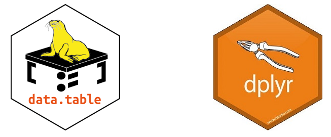
```

---

# R Markdown

- Los [R Markdown](https://rmarkdown.rstudio.com/) son similares a los notebooks de Python, y permiten tener en un único documento partes de texto (markdown) y partes de código.
- R Markdown sopote decenas de formatos de salida: HTML,PDF, MS Word, aplicaciones Shiny, etc.
- Permite también generar el output en forma de diapositivas (¡como éstas!).
- Más información sobre R Markdown en [R for Data Science](https://r4ds.had.co.nz/r-markdown.html).
- El paquete [flexdashboard](https://rmarkdown.rstudio.com/flexdashboard/) permite generar R Markdowns para dashboards interactivos.

```{r, echo=FALSE, message=TRUE, warning=TRUE, out.width="50%"}
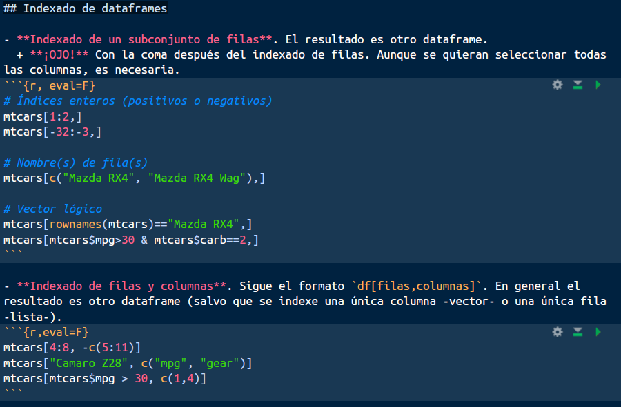
```
---


## Referencias y ayuda

- La referencia principal del curso es el libro "[R for Data Science](https://r4ds.had.co.nz/)" de Hadley Wickham y Garret Grolemund (O'Reilly 2017)

- Tiene una versión online gratuita

- Hadley Wickham es además el creador de muchos de los paquetes que componen el [tidyverse](https://www.tidyverse.org/)

- [Cheatsheet R Base](https://rstudio.com/wp-content/uploads/2016/05/base-r.pdf)

- [Cheatsheet dplyr](https://rstudio.com/wp-content/uploads/2015/02/data-wrangling-cheatsheet.pdf) 

- [Cheatsheet ggplot](https://rstudio.com/wp-content/uploads/2015/03/ggplot2-cheatsheet.pdf) 

- Acceder a la ayuda de R:
```{r, echo=T, eval=F}
?mean
help(mean)
```

---


## Más información sobre R

- **Documentación y manunales de R**: https://www.r-project.org/
- **R Reference Card**: https://cran.r-project.org/doc/contrib/Short-refcard.pdf
- **Nivel Básico**:
  + Phillips, Nathaniel D. *YaRrr! The Pirate’s Guide to R*: http://nathanieldphillips.com/thepiratesguidetor/
  + Introducción a R: https://cran.r-project.org/doc/contrib/R-intro-1.1.0-espanol.1.pdf
  + R para principiantes: https://cran.r-project.org/doc/contrib/rdebuts_es.pdf
- **Nivel avanzado**:
  + Adler, Joseph. *R in a nutshell: A desktop quick reference*. " O'Reilly Media, Inc.", 2010.
  + Burns, Patrick. *The R Inferno*. http://www.burns-stat.com/pages/Tutor/R_inferno.pdf
  + Crawley, Michael J. *The R Book*.
  + Colección *Use R!*, Springer.

---

## Más información sobre R

- [StackOverflow](https://stackoverflow.com/questions/tagged/r). Las preguntas con el **tag R** contienen mucha información y problemas resueltos. Además, las nuevas preguntas se responden en cuestión de horas.
- [CrossValidated](https://stats.stackexchange.com/). No es una comunidad específica de R (más bien estadística), pero hay mucha información acerca de cómo realizar procedimientos concretos de análisis de datos y aprendizaje automático en R.
- [@RLangTip](https://twitter.com/RLangTip). Cuenta de Twitter que publica consejos y trucos diarios.
- [The R Project for Statistical Computing](https://twitter.com/RLangTip). Grupo de LinkedIn.

