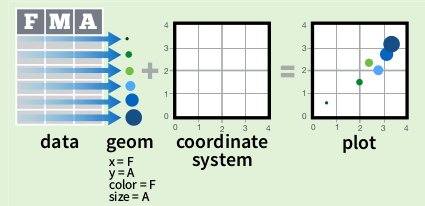
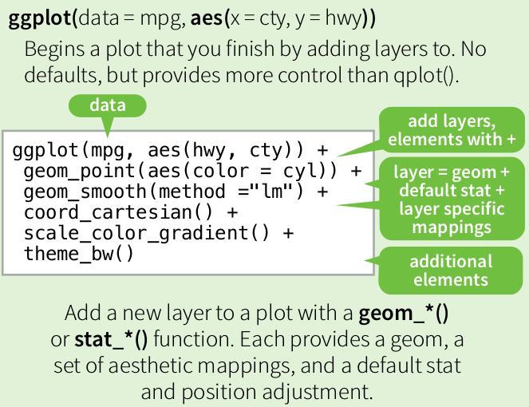
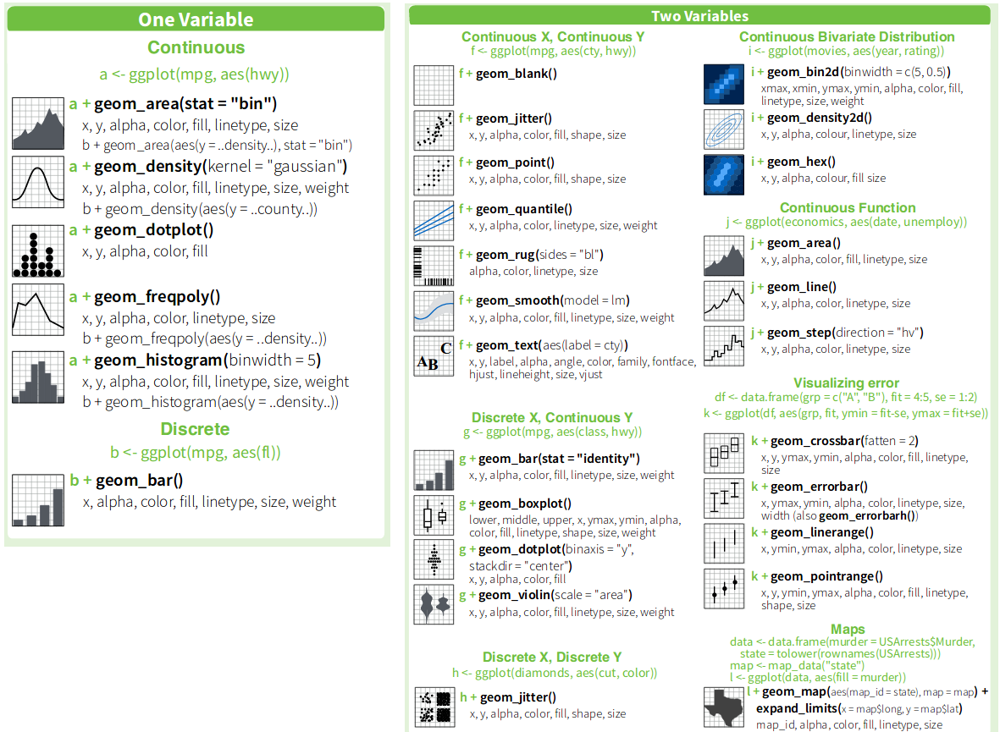
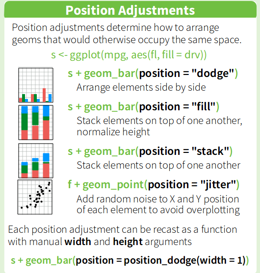

```{r setup, include=FALSE}
library(tidyverse)
library(forcats)
library(lubridate)
knitr::opts_chunk$set(echo = TRUE, message = FALSE, warning = FALSE)
```

## Introducción

- Implementa una **gramática de gráficos** en R.
- Divide un gráfico en sus componentes esenciales:
  + Un conjunto de datos.
  + Un conjunto de marcas visuales (puntos, lineas, barras) y propiedades asociadas a ellas (color, tamaño, tipo, etc.).
  + Un sistema de coordenadas.
  
<center>
```{r, echo=FALSE, message=TRUE, warning=TRUE, out.width="50%"}

```  
</center>  
  
- Múltiples ventajas con respecto a los gráficos de R base
    + Leyenda automática
    + Facetas
    + ...


---

## Introducción (cont.)

- Los capítulos de *data visualization* y *graphics for communication* del libro [R for data science](https://r4ds.had.co.nz/) son una buena forma de empzar.
- La [cheatsheet de ggplot2](https://rstudio.com/wp-content/uploads/2015/03/ggplot2-cheatsheet.pdf) es muy útil como resumen, así como la [documentación de referencia de ggplot2](https://ggplot2.tidyverse.org/reference/) que contiene muchos ejemplos.

---

## Gramática de gráficos

- Para generar un gráfico en ggplot, se usan las funciones `qplot()` o `ggplot()`.
  + `qplot()` es una versión simplificada de `ggplot()` que permite definir los datos a representar, coordenadas y la forma en qué se representar (líneas, puntos...), y provee muchos <u>valores por defecto</u>.
  
- Por su flexibilidad, veremos `ggplot()`.

---

## Gramática de gráficos (cont.)
<center>
```{r, echo=FALSE, message=TRUE, warning=TRUE, out.width="50%"}

```  
</center>  

- *data* data frame 
- *mapping* se define con `aes()` (*aesthetics*) y describe como las variables de un data frame se asignan a propiedades visuales
- *geom* objetos geométricos con el que se van a representar los datos
- *stat* transforman los datos
- *position* pequeños ajustes en la posición de los elementos

---

## Plantilla

- El gráfico más sencillo consta como mínimo de los siguientes componentes [[Fuente](https://r4ds.had.co.nz/data-visualisation.html#introduction-1)]:

```
ggplot(data = <DATA>) + 
  <GEOM_FUNCTION>(mapping = aes(<MAPPINGS>))
```
- Cambiando las secciones entre `<>` se pueden crear múltiples tipos de gráficos
- Añadiendo geoms con el operador `+` se pueden crear gráficos compuestos

---

## Ejemplo

```{r, echo=T, fig.asp=0.8}
ggplot(data = mpg) + 
  geom_point(mapping = aes(x = displ, y = hwy))
```


---

## Aesthetics


```{r, eval=F, fig.asp=0.8}
ggplot(data = mpg) + 
  geom_point(mapping = aes(x = displ, y = hwy))
```

- El gráfico anterior representa dos variables, `displ` y `cyl`
- Variables adicionales se pueden asignar a distintas propiedades del gráfico (*aesthetics*)
- Algunos ejemplos son `color`, `shape`, `size`, `alpha`, etc.
- La escala y la leyenda se crean de forma automática

---

```{r, echo=T}
ggplot(data = mpg) + 
  geom_point(mapping = aes(x = displ, y = hwy, color = drv))
```

---

```{r, echo=T}
ggplot(data = mpg) + 
  geom_point(mapping = aes(x = displ, y = hwy, color = class, size = cyl))
```

---

## Apariencia del gráfico

- Para cambiar la apariencia del gráfico, se les asigna un valor **manualmente** a las propiedades gráficas anteriores
- **No transmiten información sobre una variable**
- Tienen que estar **fuera** de la función `aes()`

---

```{r}
ggplot(data = mpg) + 
  geom_point(mapping = aes(x = displ, y = hwy), color = "blue", alpha = 0.8, shape = 2)
```


---

## Geoms

- Objectos geométricos que se usan para representar la relación entre las variables `x` e `y`
- Algunos ejemplos son:
    + `geom_bar()`, barras
    + `geom_histogram()`, histograma
    + `geom_density()`, función de densidad
    + `geom_point()`, puntos
    + `geom_line()`, lineas
    + `geom_text()`, texto
    + ...
    
- Cada `geom` tiene una serie de propiedades gráficas que se pueden asignar a variables o modificar

---

## Geoms (cont.)

<center>
```{r, echo=FALSE, message=TRUE, warning=TRUE, out.width="90%"}

```  
</center>  


---

## Múltiples geoms

Se pueden mostrar múltiples geoms añadiendo nuevas capas al gráfico:

```{r, fig.asp=0.8}
ggplot(data = mpg) + 
  geom_point(mapping = aes(x = displ, y = hwy)) +
  geom_smooth(mapping = aes(x = displ, y = hwy))
```

---

## Ajustes globales

* Se puede configurar el `aes` en la llamada a `ggplot()` y las funciones tipo `geom` tomarán ese `aes` en caso de que no se sobreescriban los atributos del `aes` en la llamada a la función `geom`.

```{r,fig.asp=0.7}
ggplot(data = mpg, mapping = aes(x = displ, y = hwy)) + 
  geom_point() +
  geom_smooth()
```

---

```{r}
ggplot(data = mpg, mapping = aes(x = displ, y = hwy, color = drv)) + 
  geom_point() +
  geom_smooth()
```

---

## Ajustes locales

```{r,fig.asp=0.8}
ggplot(data = mpg, mapping = aes(x = displ, y = hwy)) + 
  geom_point(mapping = aes(color = drv)) +
  geom_smooth(linetype = 2)
```

---

## Ajustes locales (cont.)

* También es posible cambiar los datos a representar en un `geom`.

```{r,fig.asp=0.7}
mymean <- mpg %>% group_by(displ) %>% summarize(media=mean(hwy))
ggplot(data = mpg, mapping = aes(x = displ, y = hwy)) + 
  geom_point() +
  geom_point(data=mymean,mapping=aes(x=displ,y=media),color="red")

```


---

## Transformaciones estadísticas

- Algunos `geom` calculan nuevas variables a representar a partir de las originales del data frame.
- Un ejemplo es `geom_smooth()`, que ajusta un polinomio a los datos.
- Para ver la transformación estadística de cada `geom` se puede consultar el valor por defecto del parámetro `stat` en la ayuda.

---

## Ejemplo geom_bar

```{r,fig.asp=0.8}
ggplot(data = mpg) + 
  geom_bar(aes(x = class))
```

---

## Cambiar stat por defecto

```{r}
n_class <- 
  mpg %>%
  group_by(class) %>%
  summarize(n = n())

n_class
```

---

```{r}
ggplot(data = n_class) + 
  geom_bar(aes(x = class, y = n), stat = "identity")
```

---

## Histograma

- Dada una variable continua:
    + Ordenar sus valores
    + Elegir número de intervalos
    + Contar cuantos valores hay en cada intervalo
    + Representar con barras

- La transformacion estadística se conoce como *binning*.

---

```{r}
ggplot(data = mpg) + 
  geom_bar(mapping = aes(x = hwy), stat = "bin")
```

---

## Resultado transformación

Las variables resultado de la transformación son accesibles como `..<NOMBRE>..`
  + `..count..`: número de puntos en cada bin
  + `..ncount..`: número de puntos en cada bin normalizados por el máximo de conteos sobre todos los bines.
  + `..density..`: función de densidad
  + `..ndensity..`: función de densidad normalizada por el máximo valor de densidad sobre todos los bines.

```{r, fig.asp=0.45}
ggplot(data = mpg) + 
  geom_bar(mapping = aes(x = hwy, y = ..density..), stat = "bin")
```

---

Juntando lo anterior podríamos, por ejemplo, representar un histograma con puntos en vez de barras

```{r}
ggplot(data = mpg) + 
  geom_line(mapping = aes(x = hwy, y = ..count..), stat = "bin")
```

---

## geom_histogram

```{r,fig.asp=0.8}
ggplot(data = mpg) + 
  geom_histogram(mapping = aes(x = hwy))
```

---

## geom_histogram (cont.)

* Generamos el histograma anterior normalizado y en porcentaje.

```{r,fig.asp=0.8}
ggplot(data = mpg) + 
  geom_histogram(mapping = aes(x = hwy, y=100*..count../sum(..count..)))
```

---

* De forma equivalente:

```{r,fig.asp=0.8}
ggplot(data = mpg) + 
  geom_bar(mapping = aes(x = hwy, y=100*..count../sum(..count..)),stat="bin")
```

---

## Ajustes de posición

- Ciertos `geom`s tienen un ajuste opcional de posición.
  + En `geom_bar()` su valor por defecto es `stack`.
  + En `geom_point()` su valor por defecto es `identity`.
  
<center>
```{r, echo=FALSE, message=TRUE, warning=TRUE, out.width="50%"}

```  
</center>  

---

```{r}
ggplot(data = diamonds) + 
  geom_bar(mapping = aes(x = cut, fill = color))
```

---

```{r}
ggplot(data = diamonds) + 
  geom_bar(mapping = aes(x = cut, fill = color), position = "dodge")
```

---

```{r}
ggplot(data = diamonds) + 
  geom_bar(mapping = aes(x = cut, fill = color), position = "fill")
```

---

```{r}
ggplot(data = mpg) + 
  geom_point(mapping = aes(x = cty, y = hwy))
```

---

```{r}
ggplot(data = mpg) + 
  geom_point(mapping = aes(x = cty, y = hwy), position = "jitter")
```
